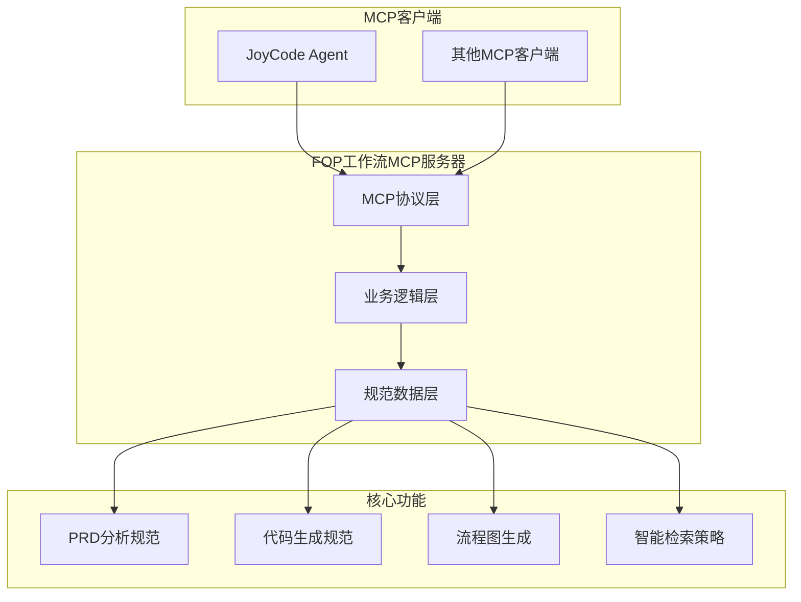

# FOP工作流MCP服务器

[](https://github.com/jd-fop/workflow-mcp-server)
[](LICENSE)
[](Dockerfile)
[](https://www.npmjs.com/package/@jd/fop-workflow-mcp-server)

> 一键使用的MCP服务器，提供完整的开发规范指导、PRD分析、代码生成和流程图生成功能。

## 🚀 快速开始

### 方式一：NPM包安装（推荐）

```bash
# 安装NPM包
npm install -g @jd/fop-workflow-mcp-server --registry=http://registry.m.jd.com

# 启动服务器
fop-workflow-mcp

# 或者构建后启动
fop-workflow-mcp --build

# 开发模式
fop-workflow-mcp --dev

# 生成配置文件
fop-workflow-mcp config -o mcp-config.json

# 健康检查
fop-workflow-mcp health
```

### 方式二：Docker容器部署

```bash
# 构建镜像
docker build -t fop-workflow-mcp:latest .

# 运行容器
docker run -d \
  --name fop-workflow-mcp-server \
  -p 8080:8080 \
  -v ./logs:/app/logs \
  fop-workflow-mcp:latest

# 或使用Docker Compose
docker-compose up -d

# 启用监控（可选）
docker-compose --profile monitoring up -d
```

### 方式三：源码运行

```bash
# 克隆项目
git clone https://github.com/jd-fop/workflow-mcp-server.git
cd workflow-mcp-server

# 安装依赖
npm install

# 构建项目
mvn clean package -DskipTests

# 启动服务
java -jar target/mcp-api-1.0.jar
```

## 📋 功能特性

### 🎯 核心工具

- **`getFopWorkflowGuide`** - 获取完整FOP工作流规范指导
- **`getPrdAnalysisRules`** - PRD分析规范和最佳实践
- **`getCodeGenerationRules`** - 代码生成规范和质量标准
- **`getFlowchartGenerationRules`** - 流程图生成规范
- **`getIntelligentRetrievalStrategy`** - 智能检索优化策略

### 🔧 技术特性

- ✅ **多协议支持**: StreamableHttp MCP协议
- ✅ **智能检索**: 70%效率提升的代码分析
- ✅ **规范完整**: 涵盖PRD分析、代码生成、流程图
- ✅ **高可用性**: Docker容器化部署
- ✅ **监控支持**: Prometheus + Grafana
- ✅ **健康检查**: 内置健康监控端点

## 🔗 MCP客户端配置

### 本地调试配置示例

```json
{
  "fop-workflow-mcp": {
    "url": "http://localhost:8080/mcp/fop-workflow",
    "autoApprove": [
      "getFopWorkflowGuide"
    ]
  }
}
```

### 直接配置MCP客户端

```json
{
  "mcpServers": {
    "fop-workflow": {
      "command": "npx",
      "args": [
        "-y",
        "--registry=http://registry.m.jd.com",
        "@jd/fop-workflow-mcp-server"
      ]
    }
  }
}
```
## 🏗️ 架构设计



## 🔧 开发指南

### 项目结构

```
fop-workflow-mcp-server/
├── src/main/java/com/jd/mcp/          # Java源码
│   └── FopWorkflowController.java      # MCP控制器
├── src/main/resources/                 # 资源文件
│   └── app.yml                        # 应用配置
├── .joycode/                          # FOP规范配置
│   ├── rules/                         # 规范规则
│   └── fop-agent-config.json         # 智能体配置
├── bin/                               # NPM命令脚本
│   └── fop-workflow-mcp.js           # 启动脚本
├── Dockerfile                         # Docker构建文件
├── docker-compose.yml                # Docker编排
├── package.json                       # NPM包配置
└── README.md                          # 项目文档
```


### 添加新功能

1. 在 `FopWorkflowController.java` 中添加新的 `@ToolMapping` 方法
2. 在 `.joycode/rules/` 中添加相应的规范文件
3. 更新 `package.json` 版本号
4. 重新构建和发布

## 🚀 部署方案

### 生产环境部署

#### 使用Docker Compose（推荐）

```yaml
version: '3.8'
services:
  fop-workflow-mcp:
    image: fop-workflow-mcp:latest
    ports:
      - "8080:8080"
    environment:
      - JAVA_OPTS=-Xms512m -Xmx1g -XX:+UseG1GC
    volumes:
      - ./logs:/app/logs
    restart: unless-stopped
    healthcheck:
      test: ["CMD", "curl", "-f", "http://localhost:8080/actuator/health"]
      interval: 30s
      timeout: 10s
      retries: 3
```

#### Kubernetes部署

```yaml
apiVersion: apps/v1
kind: Deployment
metadata:
  name: fop-workflow-mcp
spec:
  replicas: 2
  selector:
    matchLabels:
      app: fop-workflow-mcp
  template:
    metadata:
      labels:
        app: fop-workflow-mcp
    spec:
      containers:
      - name: fop-workflow-mcp
        image: fop-workflow-mcp:latest
        ports:
        - containerPort: 8080
        env:
        - name: JAVA_OPTS
          value: "-Xms512m -Xmx1g"
        livenessProbe:
          httpGet:
            path: /actuator/health
            port: 8080
          initialDelaySeconds: 60
          periodSeconds: 30
```

## 📊 监控和运维

### 健康检查

```bash
# 检查服务状态
curl http://localhost:8080/actuator/health

# 使用CLI工具
fop-workflow-mcp health
```

### 日志管理

```bash
# 查看应用日志
docker logs fop-workflow-mcp-server

# 查看文件日志
tail -f logs/application.log
```

### 性能监控

访问监控面板：
- Prometheus: http://localhost:9090
- Grafana: http://localhost:3000 (admin/admin123)

## 🤝 贡献指南

1. Fork 项目
2. 创建特性分支 (`git checkout -b feature/AmazingFeature`)
3. 提交更改 (`git commit -m 'Add some AmazingFeature'`)
4. 推送到分支 (`git push origin feature/AmazingFeature`)
5. 开启 Pull Request

## 📄 许可证

本项目采用 MIT 许可证 - 查看 [LICENSE](LICENSE) 文件了解详情

## 🆘 支持和帮助

### 常见问题

**Q: 如何更改服务端口？**
A: 使用 `--port` 参数或设置 `SERVER_PORT` 环境变量

**Q: 如何启用监控？**
A: 使用 `docker-compose --profile monitoring up -d`

**Q: 如何添加自定义规范？**
A: 在 `.joycode/rules/` 目录下添加JSON规范文件

### 技术支持

- 📧 邮箱: wanghanxiong1@jd.com/sa549236986@163.com
- 🐛 问题反馈:微信: nixionggeaa
---

**🎉 感谢使用 FOP工作流MCP服务器！**

*让AI开发更智能，让代码生成更规范！*